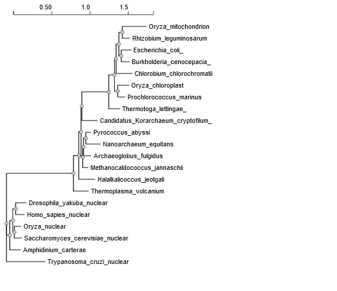
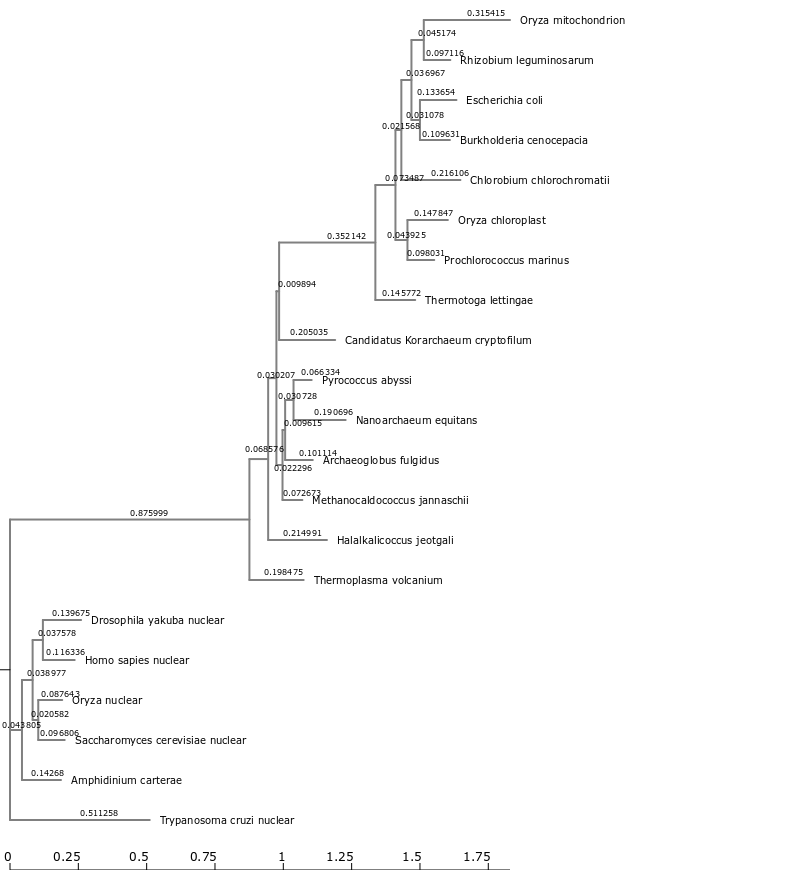

```{r setup, include=FALSE}
knitr::opts_chunk$set(echo = TRUE)
```

## Sequence Alignment, Phylogenetic Analysis and Tree Visualization

### Using NGPhylogeny.fr to analyze the set of rRNA sequences from the Tree of Life 

The One Click Workflow[@NGRPhylogeny] for phylogeny analysis was used to obtain a phylogenetic tree for the Tree of Life core sequences. The multi-sequence fasta file was submitted as input and the FastME workflow was used. The multiple alignment was performed using MAFFT with alignment curation done via BMGE and tree inference by FastME to obtain the tree in newick format.





### Phylogenetic analysis on CIPRES

Phylogenetic analysis was performed with the Tree of Life sequence data using MAFTT and FastTreeMP on CIPRES. 

Importing CIPRES[@miller2010creating] tree data:
```{r message = FALSE, warning=FALSE}
library(tidyverse)
library(ggtree)
library(treeio)
library(ggimage)
CIPRES_tree <- read.tree("data/TreeOfLife_fastree_result.tre")
CIPRES_tree
```

### Visualizing and Annotating Phylogenetic Trees with ggtree 

Loading the tutorial's newick tree data into R:
```{r}
tree <- read.tree("data/tree_newick.nwk")
tree
```

Creating a ggtree[@Yu2017] object from the data:
```{r}
# build a ggplot with a geom_tree
ggplot(tree) + geom_tree() + theme_tree()
# This is convenient shorthand
ggtree(tree)
```

There is treescale geom, which adds a scale bar. An alternate approach would be to change the default ggtree() theme to theme_tree2(), which adds a scale on the x-axis.
```{r}
# add a scale
ggtree(tree) + geom_treescale()
# or add the entire scale to the x axis with theme_tree2()
ggtree(tree) + theme_tree2()
```

To disable scaling and produce a cladogram instead set branch.length to "none";
```{r}
ggtree(tree, branch.length="none")
```

To create a cladogram with no branch scaling using thick blue dotted lines:
```{r}
ggtree(tree, branch.length="none", color="blue", size=2, linetype=3)
```

Exercise 1

    Create a slanted phylogenetic tree.
```{r}
ggtree(tree, layout="slanted")
```
    
    Create a circular phylogenetic tree.
```{r}
ggtree(tree, layout="circular")
```

    Create a circular unscaled cladogram with thick red lines.

```{r}
ggtree(tree, branch.length="none", layout="circular", color="red", size=3, linetype=7)
```


Adding additional layers to ggtree:

```{r}
# create the basic plot
p <- ggtree(tree)
# add node points
p + geom_nodepoint()
# add tip points
p + geom_tippoint()
# Label the tips
p + geom_tiplab()
```

Exercise 2

```{r}
s <-ggtree(tree)
s + geom_nodepoint(col='darkgoldenrod2', alpha=0.4, size = 4)+
  geom_tippoint(col='darkorchid3', bg='darkorchid3', pch = 23)+
  geom_tiplab(col = 'darkorchid3', offset = 0.3)+
  ggtitle("Exercise 2 Figure: Not the prettiest phylogenetic aesthetics, but it'll do")
```

Tree annotation

Internal node number

Some of the functions in ggtree for annotating clades need a parameter specifying the internal node number. To get the internal node number, geom_text can be used to display it, where the label is an aesthetic mapping to the “node variable” stored inside the tree object.

```{r}
ggtree(tree) + geom_text(aes(label=node), hjust=-.3)
```

Another way to get the internal node number is using MRCA() function by providing a vector of taxa names (created using c("taxon1", "taxon2")).. The function will return node number of input taxa’s most recent commond ancestor (MRCA). First, re-create the plot so you can choose which taxa you want to grab the MRCA from.

```{r}
ggtree(tree) + geom_tiplab()
```


The most recent common ancestor for taxa C+E and taxa G+H using MRCA() to get the internal node numbers:

```{r}
MRCA(tree, c("C", "E"))
MRCA(tree, c("G", "H"))
```

Labeling clades

The geom_cladelabel() function is used to add another geom layer to annotate a selected clade with a bar indicating the clade with a corresponding label. The clades are selected using the internal node number for the node that connects all the taxa in that clade.

```{r}
ggtree(tree) + 
  geom_cladelabel(node=17, label="Some random clade", color="red")
```

Adding the tip labels to the tree and an offset to adjust the position:
```{r}
ggtree(tree) + 
  geom_tiplab() + 
  geom_cladelabel(node=17, label="Some random clade", 
                  color="red2", offset=0.8)+
  xlim(0,65)
```

Adding another label for the clade connecting taxa G and H:
```{r}
ggtree(tree) + 
  geom_tiplab() + 
  geom_cladelabel(node=17, label="Some random clade", 
                  color="red2", offset=.8) + 
  geom_cladelabel(node=21, label="A different clade", 
                  color="blue", offset=.8)+
  xlim(0,70)
```

Problems with this tree include that the labels are not aligned and falling off the edge. The default layout plots the entire tree over the entire region of the plot.


The solution would be to first create the generic layout of the plot with ggtree(tree). Then, some tip labels are added followed by each clade label.
Also, theme_tree2() will be used to add a scale to the x-axis showing the genetic distance. This is the unit of the x-axis, and limits need to be set on the x-axis. Finally, based on preference either the theme_tree2() segment of the code can be commented out, or another theme layer can be added on top of the plot altogether, which will override the theme that was set before. theme_tree() does not have the scale.

```{r}
ggtree(tree) + 
  geom_tiplab() + 
  geom_cladelabel(node=17, label="Some random clade", 
                  color="red2", offset=.8, align=TRUE) + 
  geom_cladelabel(node=21, label="A different clade", 
                  color="blue", offset=.8, align=TRUE) + 
  theme_tree2() + 
  xlim(0, 75) + 
  theme_tree()
```

A different approach of labeling the clade would be to highlight using geom_hilight().

```{r}
ggtree(tree) + 
  geom_tiplab() + 
  geom_hilight(node=17, fill="gold") + 
  geom_hilight(node=21, fill="purple")
```

Connecting taxa

Some evolutionary events (e.g. reassortment, horizontal gene transfer) can be visualized with some simple annotations on a tree. The geom_taxalink() layer draws straight or curved lines between any of two nodes in the tree, allowing it to show evolutionary events by connecting taxa.
```{r}
ggtree(tree) + 
  geom_tiplab() + 
  geom_taxalink("E", "H", color="blue3") +
  geom_taxalink("C", "G", color="orange2", curvature=-.9)
```

Exercise 3

Finding MRCA for taxa **B+C** and taxa **L+J**:
```{r}
MRCA(tree, c("B", "C"))
MRCA(tree, c("L", "J"))
```

Drawing the tree:
```{r}
ggtree(tree) +
  geom_tiplab()+
  geom_hilight(node=19, fill="blue3")+
  geom_hilight(node=23, fill="orange2")+
  geom_cladelabel(node=17, label="Superclade 17", 
                  color="red2", offset=-7.76, align=TRUE) +
  geom_taxalink("C", "E", color="grey56", linetype=2)+
  geom_taxalink("G", "J", color="grey56", linetype=2)+
  theme_tree2()+
  ggtitle("Exercise 3 title: Not sure what we're trying to show here...")
 
```

Circular tree:
```{r}
ggtree(tree, layout="circular") +
  geom_tiplab()+
  geom_hilight(node=19, fill="blue3")+
  geom_hilight(node=23, fill="orange2")+
  geom_cladelabel(node=17, label="Superclade 17", 
                  color="red2", align=TRUE) +
  ggtitle("Exercise 3 title: Not sure what we're trying to show here...")
```

Advanced Tree Annotation

```{r, fig.height = 15, fig.width=12}
# Read the data
tree <- read.beast("data/flu_tree_beast.tree")
```


```{r, eval = FALSE}
# supply a most recent sampling date so you get the dates
# and add a scale bar
ggtree(tree, mrsd="2013-01-01") + 
  theme_tree2()
```


```{r, fig.height = 15, fig.width=12}
# Finally, add tip labels and adjust axis
ggtree(tree, mrsd="2013-01-01") + 
  theme_tree2() + 
  geom_tiplab(align=TRUE, linesize=.5) + 
  xlim(1990, 2020)
```

With multiple-sequence alignment side by side:
```{r}
msaplot(p=ggtree(tree), fasta="data/flu_aasequence.fasta", window=c(150, 175))
```

Bonus

For plotting many trees at once and faceting them the normal ggplot2 way. The code below generates 3 replicates each of 4 random trees with 10, 25, 50, and 100 tips, plotting them all.
```{r}
set.seed(42)
trees <- lapply(rep(c(10, 25, 50, 100), 3), rtree)
class(trees) <- "multiPhylo"
ggtree(trees) + facet_wrap(~.id, scale="free", ncol=4) + ggtitle("Many trees. Such phylogenetics. Wow.")
```

Plotting tree with other data:
```{r}
# Generate a random tree with 30 tips
tree <- rtree(30)
# Make the original plot
p <- ggtree(tree)
# generate some random values for each tip label in the data
d1 <- data.frame(id=tree$tip.label, val=rnorm(30, sd=3))
# Make a second plot with the original, naming the new plot "dot", 
# using the data you just created, with a point geom.
p2 <- facet_plot(p, panel="dot", data=d1, geom=geom_point, aes(x=val), color='red3')
# Make some more data with another random value.
d2 <- data.frame(id=tree$tip.label, value = abs(rnorm(30, mean=100, sd=50)))
# Now add to that second plot, this time using the new d2 data above, 
# This time showing a bar segment, size 3, colored blue.
p3 <- facet_plot(p2, panel='bar', data=d2, geom=geom_segment, 
           aes(x=0, xend=value, y=y, yend=y), size=3, color='blue4') 
# Show all three plots with a scale
p3 + theme_tree2()
```


Overlaying organism silouhettes

Using ggtree to overlay a phylopic image on the plot at a desired node:

```{r}
# get phylopic 

newick <- "((Pongo_abelii,(Gorilla_gorilla_gorilla,(Pan_paniscus,Pan_troglodytes)Pan,Homo_sapiens)Homininae)Hominidae,Nomascus_leucogenys)Hominoidea;"

tree <- read.tree(text=newick)

d <- ggimage::phylopic_uid(tree$tip.label)
d$body_mass = c(52, 114, 47, 45, 58, 6)

p <- ggtree(tree) %<+% d + 
  geom_tiplab(aes(image=uid, colour=body_mass), geom="phylopic", offset=2.5) +
  geom_tiplab(aes(label=label), offset = .2) + xlim(NA, 7) +
  scale_color_viridis_c()
p  
```

## Visualization and annotation of the CIPRES phylogenetic tree 

```{r fig.width = 8, fig.height = 8}
ggtree(CIPRES_tree)+
  xlim(0,2)+
  geom_tiplab()+
  geom_nodelab(size = 3, hjust = -0.1)
```


```{r}
ggtree(CIPRES_tree) +
  xlim(0,2)+
  geom_tiplab(hjust=-.1, size = 3)

```

Coloring the phylogeny based on the domains of life:

```{r}
MRCA(CIPRES_tree,"Drosophila_yakuba_nuclear","Trypanosoma_cruzi_nuclear")
MRCA(CIPRES_tree, "Nanoarchaeum_equitans","Candidatus_Korarchaeum_cryptofilum_")
MRCA(CIPRES_tree,"Thermotoga_lettingae_", "Chlorobium_chlorochromatii")
```


```{r fig.height = 8, fig.width = 8}
ggtree(CIPRES_tree, layout="circular")+
  geom_tiplab(align=TRUE)+
  xlim(0,3.6)+
  geom_hilight(node=22, fill="green",extend = -0.07)+
  geom_hilight(node=25, fill="blue", extend = -0.06)+
  geom_hilight(node=30, fill="gold", extend = 0.48)
  
```

## References